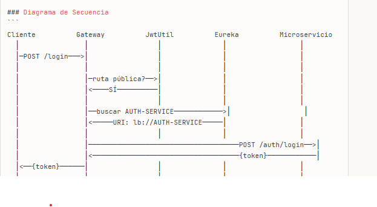

# API Gateway - Documentación Técnica

## Tabla de Contenidos

1. [Introducción](#introducción)
2. [Arquitectura General](#arquitectura-general)
3. [Componentes Principales](#componentes-principales)
4. [Flujo de Autenticación](#flujo-de-autenticación)
5. [Configuración](#configuración)
6. [Endpoints Disponibles](#endpoints-disponibles)
7. [Manejo de Errores](#manejo-de-errores)
8. [Seguridad](#seguridad)
9. [Ejemplos de Uso](#ejemplos-de-uso)

---

## Introducción

El **API Gateway** actúa como punto único de entrada para todos los microservicios de la aplicación. Implementa funcionalidades críticas como enrutamiento, validación de tokens JWT, balanceo de carga y gestión centralizada de la seguridad.

### ¿Qué es un API Gateway?

Un API Gateway es un servidor que funciona como intermediario entre los clientes y los microservicios backend. Proporciona:

- **Enrutamiento inteligente**: Dirige las peticiones al microservicio correspondiente
- **Seguridad centralizada**: Valida tokens JWT antes de permitir el acceso
- **Load Balancing**: Distribuye la carga entre múltiples instancias
- **Service Discovery**: Se integra con Eureka para descubrir servicios dinámicamente

---

## Arquitectura General

## Componentes Principales

### 1. AuthenticationFilter

**Responsabilidades**:
- Interceptar todas las peticiones HTTP entrantes
- Validar la presencia y validez del token JWT
- Permitir el paso solo a peticiones autenticadas (excepto rutas públicas)
- Agregar información del usuario en headers personalizados

### 2. RouteValidator

**Responsabilidades**:
- Definir qué rutas son públicas (no requieren autenticación)
- Definir qué rutas requieren validación de token

## Diagrama de Secuencia

Pasos 
1. Cliente → Gateway
   POST /api/auth/login

2. Gateway revisa su configuración (application.yml)
    - Encuentra la ruta: Path=/api/auth/**
    - Lee: uri: lb://AUTH-SERVICE

3. Gateway procesa "lb://"
   ├─> "Necesito resolver AUTH-SERVICE"
   └─> Llama a Spring Cloud LoadBalancer
   └─> LoadBalancer consulta Eureka
   └─> Eureka responde: "AUTH-SERVICE está en http://ricardo:8005"
   └─> LoadBalancer retorna la URI real al Gateway

4. Gateway usa la URI real
   POST http://ricardo:8005/auth/login

OBS:
Cuando el Gateway ve `lb://AUTH-SERVICE`, hace lo siguiente:

1. **No busca directamente en Eureka** - La configuración `lb://` le dice al Gateway "usa load balancing"
2. **Spring Cloud LoadBalancer** (integrado con Eureka) se encarga de:
    - Consultar a Eureka por todas las instancias de `AUTH-SERVICE`
    - Obtener las URIs reales (ej: `http://192.168.1.10:8005`)
    - Seleccionar una instancia (si hay múltiples)
    - Reemplazar `lb://AUTH-SERVICE` con la URI real